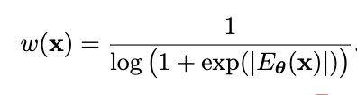
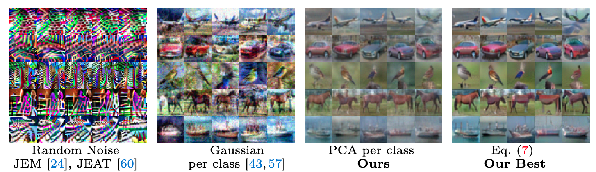
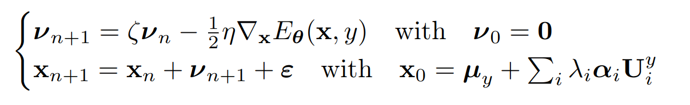

<div align="center">
<h1>SHEDDING MORE LIGHT ON ROBUST CLASSIFIERS UNDER THE LENS OF ENERGY-BASED MODELS</h1>

[**Mirza Mujtaba Hussain**](https://github.com/hussainmujtaba7) <sup>1</sup>  [**Maria Rosaria Briglia**](https://github.com/Merybria99) <sup>1</sup>  [**Senad Beadini**](https://github.com/senad96) <sup>2</sup>  [**Iacopo Masi**](https://github.com/iacopomasi) <sup>1</sup>.


<sup>1</sup>Sapienza University of Rome, Italy · <sup>2</sup> Eustema SpA, Italy


<a href=''></a>
<a href=''></a>


Welcome to the official GitHub repository for our ECCV 2024 paper, "Shedding More Light on Robust Classifiers Under the Lens of Energy-Based Models". This repository contains the implementation of the methods and experiments discussed in the paper, providing all the necessary resources to reproduce our results and explore the techniques we developed.
</div>


## About the project
This work reinterprets a robust discriminative classifier as Energy-based Model (EBM) and offer a new take on the dynamics of adversarial training.  Our research introduces novel theoretical and practical insights demonstrating how analyzing the energy dynamics of adversarial training (AT) enhances our understanding. We also present a instance reweighting scheme, that weights samples based on their energy while adversarial training, thereby improving the model's robustness. This project also explores the generative capabilities of robust classifiers under the lens of energy-based models (EBMs). We demonstrate that robust classifiers exhibit varying intensities and qualities in their generative capabilities. Furthermore, we propose a straightforward method to enhance this capability.


<div align="center"">
  
  <div style="font-style: italic; margin-top: 10px;">
    Generating images with an adversarially trained model.
  </div>
  <br> </div>

<div align="center">
   &nbsp;&nbsp;&nbsp;&nbsp;&nbsp;&nbsp;&nbsp;&nbsp;&nbsp;&nbsp;&nbsp;&nbsp;&nbsp;&nbsp;&nbsp;&nbsp;&nbsp;&nbsp;&nbsp;&nbsp;&nbsp;&nbsp;&nbsp;&nbsp;
  
  <div style="text-align: center;">
    <div style="font-style: italic; margin-top: 5px;">Visualization of the dynamics of the changes in joint energy and marginal energy during adversarial training. The left plot corresponds to SAT, while the right plot illustrates TRADES. For a better understanding, refer to Fig. 1 (b,c,d) in the paper.</div>
  </div>
</div>


## Environment settings and libraries we used in our experiments

This project is tested under the following environment settings:
- OS: Ubuntu 20.04
- GPU: Quadro RTX 6000
- Cuda: 11.6
- Python: 3.10
- PyTorch: 2.1.1 

## Usage

To apply the instance reweighting, you first need to calculate the energy of the samples using the logits produced by the model. Here's a function to do that:
```python
      def calculate_energy(logits):
        return -torch.logsumexp(logits, dim=1)
```

Next, we shall use the energy to weight the samples and apply to a loss function such as TRADES:
```python
     
      for data, target in train_data_loader:
          
          # Get logits from model
          logits = model(data)
          
          # Calculate the energy of the samples
          energy = calculate_energy(logits).detach()
          
          # Compute weights using the energy
          weights = compute_weights(energy)

          # Generate adversarial samples
          adv_data = generate_adversarial_samples(model, data)

          #implement TRADES
          loss_ce =  (1.0 / batch_size) * torch.sum(F.cross_entropy(logits, y, reduction='none') *  weights)
          loss_kl = (1.0 / batch_size) * torch.sum(
          torch.sum(kl_sample(torch.log(F.softmax(model(x_adv), dim=1) + 1e-12), F.softmax(logits, dim=1)),dim=1) * weights)
        
          loss = loss_ce + (beta * loss_kl) 
```

Based on the energy values, each sample must be assigned a specific weight such that high energy samples are weighted more compared to lower energy samples. This paper utilizes the following weighting function:

<p align="center">
  
</p>

  ``` python
          def compute_weights(energy):
            return (1/(torch.log(1+torch.exp(torch.abs(energy))))))
  ```

The python file ```Adversarial ML/WEAT_loss.py``` contains the complete loss function implementing the WEAT_adv loss from the paper. You can also find notebook ```Adversarial ML/Energy_analysis_sec_3.ipynb``` that shows the analysis conducted in the section ```Different Attacks Induce diverse Energy Landscapes``` from the paper.

## Improving Generative capabilities of Robust Models

<p align="center">
  
</p>

The repository of the project presents in the ```image_generation``` directory the framework used for generating images through the framework presented in the paper. 
The subfolder ```image_generation/notebooks``` contains the set of notebook used for the ablation study of the paper, in which generations in the multiple setting considered in the paper are executable.  
The notebook ```image_generation/Image_generation.ipynb``` contains the code for generating paper and appendix images images, while the code for generating is contained in the file ```image_generation/utils.py```..

### Initialization
The initialization method proposed in the paper is a classwise PCA setting in which the initial point ```x_0``` is computed by applying the PCA on the samples of the class willing to be generated. 

Once defined the initial sample the algorith applies Stochastic Gradient Langevin Dynamics (SGLD) with momentum for iteratively obtaining gradients on top of the initial image. Gradients are obtained by with the aim of maximizing the joint energy of the model considering  ```y``` the label willing to be generated and ```x``` the current state of the generation.

<p align="center">
  
</p>

## Video Tutorial

The following talk at [USC Information Sciences Institute](https://www.isi.edu/) by Iacopo Masi discusses robustness and generative modeling, and includes work presented in our paper:
[](https://www.youtube.com/watch?v=dY9d2oRkU3w)

## Reference
```
@inproceedings{mirza2024shedding, 
  author = {Mirza Mujtaba Hussain, Maria Rosaria Briglia, Senad Beadini, Iacopo Masi}, 
  title = {Shedding More Light on Robust Classifiers under the lens of Energy-based Models}, 
  booktitle = {European Conference on Computer Vision},
  year = {2024}
}
```
